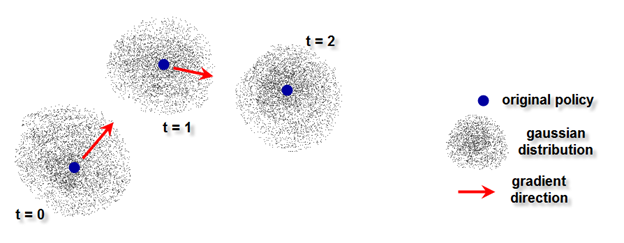
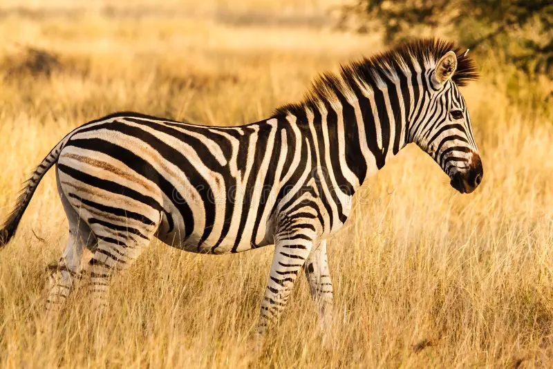
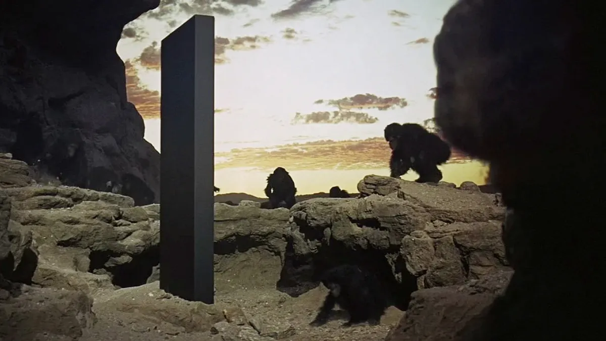
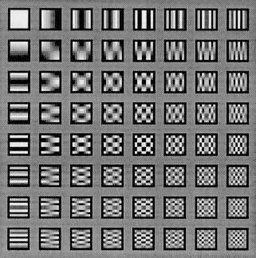
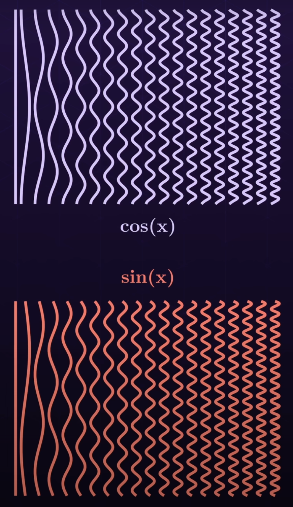
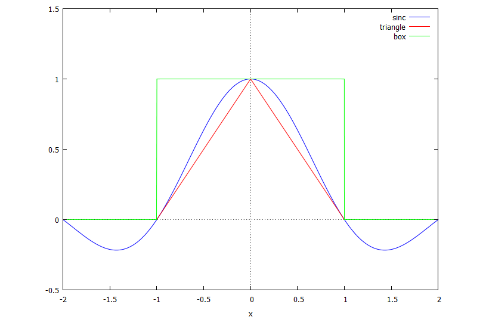
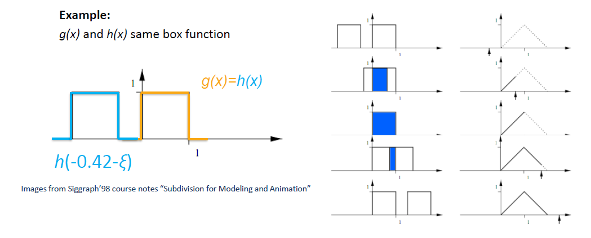
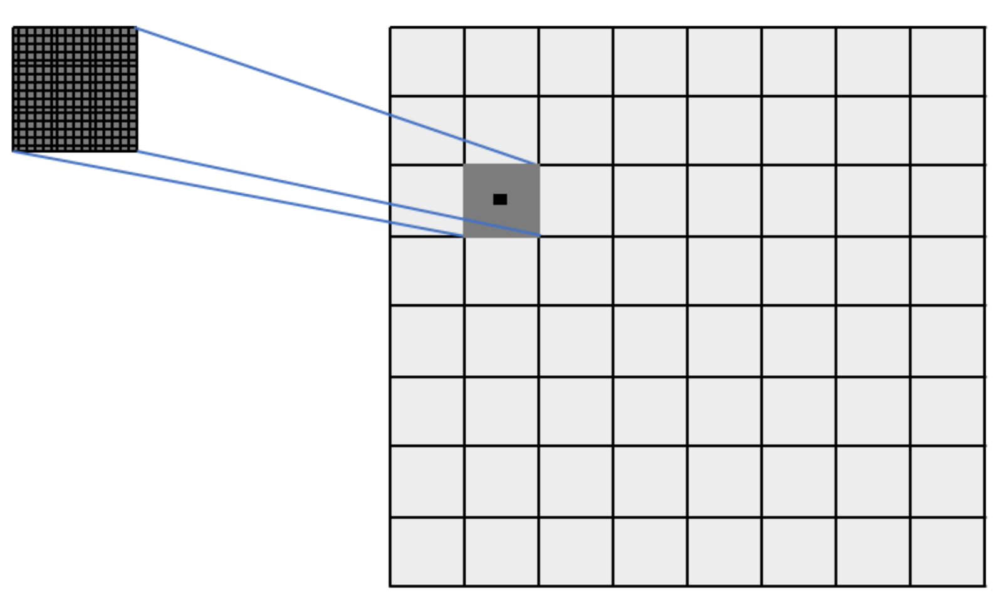

# Adversarially Testing Perceptural Hash Functions


## 0.0 Motivation

Perceptual hash algorithms are a widely used form of image detection, wherein a special algorithm is used to encode core image features in an n-bit hash, where n is variable depending on the algorithm context. This allows for two important attributes to be obtained:

1. An image 'fingerprint' can be acquired, which is much more convenient to store than the actual image, and in the case of harmful content does not require replication. 

2. The 'fingerprint' encoding is made from the core features of the image, and is thus resistant to minor changes. 

This makes perceptual hashes widely used tools for the detection of copyrighted material or harmful content. However, such a system naturally begs the following question:
"Is there a way in which we can perturb the image such that the hash difference is greatest for some perturbation of a given magnitude?"

The answer is yes, to a different degree depending on the hash algorithm used. The motivation behind this project is two-fold:

1. Determine which perceptual hash algorithms are most resistant to gradient-based evasion attacks. 

2. Determine which perceptual hash algorithms are most complementary to each other when deployed in an image recognition pipeline.


There is [published research](https://arxiv.org/pdf/2106.09820) that implictly touches on these two points, but it quantifies attack/hash effectiveness by the rate at which false positive/false negatives occur in a pipeline over a database of a given size with n poisoned images. For content moderation systems, I think this makes sense. However, I think that it would be more useful to first broadly quantify how succeptible a given hash is to a basic gradient-based attack. To my knowledge, no published research clearly spells this out in a practical manner. Perceptual hash algorithms tend to be non-differentiable, but the difficulty of performing zeroth-order approximation on a given algorithm does vary. This will be clarified later on.

I also wanted to do this out of personal interest, because it's an under-researched subject and it's a good way to combine topics from both DSP and modern ML in a way that encourages and rewards writing highly performant code on a modern stack.

For fairly obvious ethical reasons, I have decided to hold off on releasing the full codebase. At least until it becomes a more formal project and not a hobby hack. However, I am not providing any sort of turnkey evasion toolkit, and previous research released information at a significantly higher degree of usability [like this one](https://github.com/ml-research/Learning-to-Break-Deep-Perceptual-Hashing?tab=readme-ov-file) or [this one](https://github.com/bethgelab/foolbox), so I believe it is justified to share some of the core ideas and more interesting parts of the code here.


## 1.0 How a Gradient-Based Attack Works (NES Flavour)

#### Figure 1.0 NES Visualized
<p align="center">
  
</p>


Perceptual hash functions tend to be non-differentiable. To think about this, imagine the image as a point in high-dimensional space, where each axis of travel represents the pixel intensity for a given pixel on the image. As we move our point around in high-dimensional space, the hash value will change accordingly. However, since hash functions are non-differentiable, the function relating the hash value to the point's position is not a continuous function. If we were trying to change the hash as much as possible while changing the position of our point as little as possible, we'd want to find the direction in which we could move the point the least while changing the hash the most. From multivariable calculus this is known as the gradient, and the gradient vector will point in the same direction as the ratio between how the hash changes with point shift across all axes of motion. 

However, because the hashes are non-differentiable, it is hard to determine the rate at which the hash will change when the point is moved in a given direction, thus it is also hard to compute the gradient. To get around-this, we can perform a linear approximation dH/ds (where H is the hash value and s is the magnitude of our position shift) across all (most) possible directions of motion in order to obtain an approximation of the gradient. From here, we can adjust our point in the direction of that vector in order to change our hash value.


Since our image is a very high-dimensional vector, it's not practical to model change across every direction, so instead we will seek to maximize evenly-spaced directional coverage. In three-space, if we drew our target vectors coming out from our point, it would look like an [old-school naval mine](https://www.alamy.com/naval-mine-isolated-old-sea-mine-3d-rendering-3d-illustration-image465891455.html) where each vector is more or less evenly spaced from from the others. Instinctively we know that to do this, we should sample our vectors from a random distribution, but which distribution should we use? Fortunately, we also instinctivelly know that when in doubt, using the Gaussian distribution tends to work well, and that is indeed the distribution we will use here. 

One might ask why the Gaussian distribution will actually work the best here? Visually the reason why is because the Gaussian distribution has a zero-mean and is symmetric. Zero-mean means that in our three-space point example, if each vector maps to a force exerted on our point, then given a lot of vectors the forces will cancel out and our point will not move. Symmetry means, in our three-space example, that if we enclose the point inside a sphere, we tend to have as many vectors on one hemisphere as the other, and the average magnitudes of the vectors inside either hemisphere will be equal. This means that the vector sum of the two hemispheres will be approximately equal in magnitude and opposite in direction, no matter how the sphere is split in half.

Technically, other zero-mean, symmetric distributions can be used in place of the Gaussian distribution. The reason why the Gaussian distribution is preferred comes down to one final factor known as rotational symmetry or isotrophy. Some distributions like the Bernouli distribution are zero-mean and symmetric, but don't spread out the vectors nicely because it oversamples coordinate axes. This means that in three-space, our old-school naval mine has its spikes in clusters instead of spread out evenly across the surfaces. The net force exerted is still zero and all hemispherical vector sums still cancel each out, but we are not accurately capturing all possible directions of movement and thus our gradient estimation is prone to inaccuracy. In other words, when we collect perturbations, we are more likely to move our point in some directions than in others. This is not good.

There are some other less obvious reasons (extreme samples are rare, Stein's Lemma can be used to simplify our math since our score function for the nudge vector is just the nudge vector itself, etc) but they are outside the scope of this document.

Now we would like to know how we obtain this gradient. What we can do is scale each nudge vector by the magnitude of the hash delta that it incurrs, sum all scaled vectors, and then divide by the total number of vectors in order to get the average direction that corresponds with hash change. This vector points in the same direction as the vector representing the ratio between how the hash changes with point shift across all axes of motion, and thus will approximate our gradient. We have to scale each nudge vector appropriately before computing the hash though, if they are too small, no hash change will occur and we can't compute the gradient. If they are too large, they won't accurately reflect gradient characteristics at that particular point. Tuning this scale factor is an involved process and it varies depending on the hash being tested because the optimization surface will also change accordingly. Not only this, testing has shown that the hash optimization surface also changes based on the image (which you would expect, because because the spectral characteristics will vary between images). Actually, this would be a good time to show off the 'hyperparameters', here they are:


```
PHASH_HYPERPARAMETERS = {
    "alpha"         : 2.9,
    "beta"          : 0.9,
    "step_coeff"    : 0.00002,
    "scale_factor"  : 0.5
}

AHASH_HYPERPARAMETERS = {
    "alpha"         : 2.9,
    "beta"          : 0.9,
    "step_coeff"    : 0.00007,
    "scale_factor"  : 0.4
}

DHASH_HYPERPARAMETERS = {
    "alpha"         : 2.9,
    "beta"          : 0.85,
    "step_coeff"    : 0.000013,
    "scale_factor"  : 0.3
}
```

Here, 'alpha' and 'beta' are suprise tools that we will use later, 'step_coeff' is the multiplier applied to our gradient vector, and 'scale_factor' is the constant we use to scale our perturbation vectors such that they change the hash enough so that we can figure out where the direction of greatest change is but not enough that it overshoots and gives us information that is irrelevant to the state of our current image vector. 

The ideal set of 'hyperparamters' for a given image will change based on the image and the hash being used. This is quickly visible through experimentation.

This whole streategy of using normally distributed perturbations to estimate a gradient falls under a family of algorithms known as Natural Evolutionary Strategies (NES), and composes the core of our attack logic. 


## 2.0 Algorithm Core

The core attack algorithm is contained inside the spectra/ module (module name carefully chosen to enhance productivity), and it is based on the black-box algorithm detailed in [this paper](https://www.usenix.org/system/files/sec22-jain.pdf).

Conceptually the algorithm is relatively straightforward. We generate a bunch of perturbation vectors from which to get the gradient (as discussed previously), scale them so that we are able to 'feel' out the hash-image optimization surface accurately, calculate the gradient from our perturbation vector batch (as discussed previously), then 'step' in the direction of that gradient. We then do the same thing again and again until we either hit a limit on the number of steps, the hamming difference between our original and our current hash exceeds the threshold we have defined, or the current distortion exceeds our distortion budget (if it has been set). We can then do this mutiple times and pick the best attack (WRT minimal distortion) that still breaks the hamming threshold if we so desire.

There are some other things as well: We include the option to use momentum from the previous step to reduce some of the noise during our ascent, the ratio of current to previous step contributions is provided by the 'beta' hyperparameter. The one issue with doing it this way is there is now an IIR characteristic added to the overall system, which is not great given the necessary ruggedness of a hash-image optimization surface - if you don't want this, just set your `beta` to 1. We also analytically clamp each step, scaling our deltas by the minimum of 1.0 or the maximum amount that can be applied to the tensor without any modified pixel violating our pixel quantization boundary (if our delta violates quantization boundaries, we scale it by the bare minimum that it takes to make this not happen). The benefit of this over standard clamping e.g. `clamp(0.0, 1.0)` is that it preserves the shape of the delta vector without truncating one or more of it's components, allowing better gradient alignment in the process. The added benefit of analytic clamping is that it also ensures that our previous step is less likely to pollute our current step with inappropriately sized values. This is the first main difference between my algorithm and Jain et Al's algorithm. The second is I use the full gradient signal in conjunction with the analytic clamping and scaled by the step size. Jain et Al used only the signed representation of the gradient vector scaled by the step size, which during testing proved to produce a significantly less effective attack.

I also added 8-bit quantization before the perturbation hash distances were calculated. This also seemed to improve attack effectiveness during experimentation.


<details>
<summary>Core NES Logic (click to expand)</summary>

```python

EPS = 1e-6


def generate_perturbation_vectors(num_perturbations, shape, device):
    base    = torch.randn((num_perturbations // 2, *shape), dtype=torch.float32, device=device) 
    absmax  = base.abs().amax(dim=1, keepdim=True)
    scale   = torch.where(absmax > 0, 1.0 / absmax, torch.tensor(1.0, device = device)) 
    base    = base * scale
    return torch.cat([base, -base], dim=0) 


#Analytic Clamp
def anal_clamp(tensor, step, vecMin, vecMax, scale_factor=1.0):
    device              = tensor.device
    
    pos_scale = torch.where(
        step > 0,
        (vecMax - tensor) / (step + EPS),
        torch.tensor(scale_factor, device=device),
    )
    neg_scale = torch.where(   
        step < 0,
        (vecMin - tensor) / (step - EPS),
        torch.tensor(scale_factor, device=device),
    )
    
    safe_scale_vector   = torch.min(pos_scale, neg_scale).clamp(min=0.0, max=scale_factor)
    return safe_scale_vector


def compute_gradient(self, perturbation_scale_factor, num_perturbations, vecMin=None, vecMax=None):
    tensor              = self.tensor    
    func                = self.func
    loss_func           = self.loss_func
    quant_func          = self.quant_func
    func_device         = self.func_device
    loss_func_device    = self.loss_func_device
    quant_func_device   = self.quant_func_device
    device              = tensor.device

    perturbations       = generate_perturbation_vectors(num_perturbations, tensor.shape, device) #[[p11, p12, p13], [p21, p22, p23], [p31, p32, p33]]
    last_output         = func(tensor).to(loss_func_device)

    if vecMin is not None and vecMax is not None:
        safe_scale      = anal_clamp(tensor, perturbations, vecMin, vecMax, perturbation_scale_factor)
        cand_batch      = (tensor + perturbations * safe_scale).to(func_device).clamp(vecMin, vecMax) #[t1, t2, t3] + [[p11, p12, p13], [p21, p22, p23], [p31, p32, p33]] -> [[c11, c12, c13], [c21, c22, c23], [c31, c32, c33]] where cxy = t[y] + p[x,y]
    
    else:
        cand_batch      = (tensor + perturbations).to(func_device)

    if quant_func is not None:
        cand_batch      = quant_func(cand_batch.to(quant_func_device))

    new_outputs         = func(cand_batch).to(loss_func_device) 
    diffs               = loss_func(new_outputs, last_output)       
    deltas              = diffs.sum(dim=1).to(tensor.dtype).view(num_perturbations, *((1,) * tensor.dim()))

    return (deltas * perturbations.to(device)).sum(dim=0).to(device).view(tensor.shape)  #[d1, d2, d3] -> VecSum([[d1], [d2], [d3]] * [[p11, p12, p13], [p21, p22, p23], [p31, p32, p33]]) -> [g1, g2, g3] where gx = [dx] * [px1, px2, px3]


for _ in range(num_steps): 

    step            = self.engine.compute_gradient(perturbation_scale_factor=perturbation_scale_factor, num_perturbations=num_perturbations, vecMin=self.vecMin, vecMax=self.vecMax)

    step            = (step * beta + prev_step * alpha) * step_coeff

    if vecMin is not None and vecMax is not None:
        safe_scale  = anal_clamp(tensor, step, vecMin, vecMax, perturbation_scale_factor)
        step        = step * safe_scale

    prev_step       = step

    tensor          += step
    delta           += step
```
</details>


## 2.1 Delta Recovery

A lot of hash algorithms resize the image and convert from RGB to either luma or grayscale (more on this later). It's redundant to do this every step, so it makes more sense to do it once at the beginning, use that 'working tensor' inside the optimizer hot loop to get our overall perturbation delta, then upsample that delta at the end and convert it back to RGB. Here's the relevant code for doing that:


<details>
<summary>Delta Recovery Code</summary>

```python

def tensor_resize(input_tensor, height, width):
    tensor = input_tensor.clone().unsqueeze(0)      #[{3,1}, H, W] -> [1, {3, 1}, H, W]
    tensor_resized = F.interpolate(                 #Interpolate needs to know batch and channel dimensions thus a 4-d tensor is required
        tensor,
        size=(height, width),
        mode='bilinear',
        align_corners=False
    )
    return tensor_resized.squeeze(0)                #[1, {3, 1}, H, W] -> [{3,1}, H, W]


def generate_inversion(inversion_str: str):

    def inverse_delta(tensor, delta, eps=1e-6):
        C, H, W = tensor.shape
        if delta.shape == (C, H, W):
            return delta

        rgb_mean = tensor.mean()        # [1, H, W]
        gd = delta.unsqueeze(0)         # [1, H, W]
        
        # Avoid division by zero
        delta = torch.where(
            gd <= 0,
            gd * tensor / (rgb_mean + eps),
            gd * (1 - tensor) / ((1 - rgb_mean) + eps)
        )
        return delta.view(C, H, W)

    def inverse_delta_local(tensor, delta, eps=1e-6):
        C, H, W = tensor.shape
        if delta.shape == (C, H, W):
            return delta

        rgb_mean = tensor.mean(dim=0, keepdim=True)     # [1, H, W]
        gd = delta.unsqueeze(0)                         # [1, H, W]
        
        # Avoid division by zero
        delta = torch.where(
            gd <= 0,
            gd * tensor / (rgb_mean + eps),
            gd * (1 - tensor) / ((1 - rgb_mean) + eps)
        )
        return delta.view(C, H, W)

    def inverse_luma(tensor, delta):
        if delta.dim() == 2:               # delta is (H, W)
            delta = delta.unsqueeze(0)     # -> (1, H, W)

        r, g, b = tensor[0], tensor[1], tensor[2]

        luma = (0.2126*r + 0.7152*g + 0.0722*b).unsqueeze(0)   # (1, H, W)
        new_luma = torch.clamp(luma + delta, 0.0, 1.0)         # broadcast OK
        ratio    = (new_luma+1e-6) / (luma+1e-6)               # (1,H,W)
        perturbed = tensor * ratio                             # (3,H,W)
        delta_rgb = perturbed - tensor                         # (3,H,W)
        return delta_rgb

    def no_inversion(tensor, delta):
        return delta

    inversion_table = {"grayscale" : inverse_delta, "grayscale_local" : inverse_delta_local, "luma" : inverse_luma, "noinvert" : no_inversion} #TODO: Add inverse luma
    if inversion_str not in inversion_table.keys():
        raise ValueError(f"'{inversion_str}' not in set of valid acceptance function handles: {inversion_table.keys()}")

    return inversion_table[inversion_str]
```

</details>


I've decided to use a bilinear transform for image resizing, but bicubic works fine as well. I have two versions of the inverse delta algorithm, the original `inverse_delta_local`, which I took from [the paper that I mentioned above](https://www.usenix.org/system/files/sec22-jain.pdf), and my own, `inverse_delta`, which I found experimentally worked better for most images. The core difference between the two is that the local version uses the per-pixel average across all three channels at a given point on the 2-D image plane, while the nonlocal version uses the average across all pixels in all channels as the basis. This fixed an issue I was observing at higher distortion levels where the sharpest, darkest edges of the attacked images started to sparkle after the inverse delta was applied. I believe this is due to the per-pixel RGB mean in these location being very low, so when applied to the delta transformation as a denominator, the delta gets scaled to an inappropriately large magnitude. While I was born to sparkle, my attacked images were not, and so I used the image-wide average instead, which traded the sparkles for a more spread out 'faded' distortion pattern during high-delta attacks. I also added an inverse luma transform, which currently runs poorly, so I won't talk about it. I feel like using some sort of box or tent filter (as I will discuss shortly)
might provide a sort of happy middle ground here, and should be investigated further.

#### Figure 2.1.0: Local vs Global Pixel Averaging Comparison
<div style="display: flex; gap: 2rem; justify-content: center; align-items: flex-start;">

  <!-- Local Averaging Panel -->
  <div>
    <h4 style="text-align: center; margin-bottom: 0.2em; color: #111;">Local Averaging</h4>
    
    <pre style="background: #f5f5f5; color: #111; padding: 1em; border-radius: 4px; margin-top: 0.2em;">
    Local Post-Validation:
        lpips:             0.08449968695640564
        l2:               0.13197070360183716
        ahash_hamming:         14
        dhash_hamming:         24
        phash_hamming:        20
        pdq_hamming:          40
    </pre>
  </div>

  <!-- Global Averaging Panel -->
  <div>
    <h4 style="text-align: center; margin-bottom: 0.2em; color: #111;">Global Averaging</h4>
    
    <pre style="background: #f5f5f5; color: #111; padding: 1em; border-radius: 4px; margin-top: 0.2em;">
    Non Local Post-Validation:
        lpips:             0.0440366193652153
        l2:               0.12141172587871552
        ahash_hamming:         17
        dhash_hamming:         27
        phash_hamming:        24
        pdq_hamming:         36
    </pre>
  </div>

</div>


## 3.0 System Architecture

Grayscaling and resizing is also completely optional. A `Hash_Wrapper` class is provided to specificy these details, and allows efficient composability of novel hash pipelines.


<details>
<summary>Hash Modularization (click to expand)</summary>

```python

class Hash_Wrapper:
    
    def __init__(self, name: str, func, resize_height: int=-1, resize_width: int=-1, available_devices: set[str]={"cpu"}):
        self.name = name
        self.func = func
        self.resize_height = resize_height
        self.resize_width = resize_width
        self.available_devices = available_devices


    def get_name(self):
        return self.name

    def get_info(self):
        return self.func, self.resize_height, self.resize_width, self.available_devices


AHASH = Hash_Wrapper(name="ahash", func=generate_ahash_batched, resize_height=8, resize_width=8, available_devices={"cpu", "cuda", "mps"}) #Cannonical ahash resizes to 8x8

AHASH_RGB = Hash_Wrapper(name="ahash_rgb", func=generate_ahash_rgb_batched, resize_height=8, resize_width=8, available_devices={"cpu", "cuda", "mps"})

DHASH = Hash_Wrapper(name="dhash", func=generate_dhash_batched, resize_height=8, resize_width=8, available_devices={"cpu", "cuda", "mps"}) #Cannonical dhash resizes to 8x8

DHASH_RGB = Hash_Wrapper(name="dhash_rgb", func=generate_dhash_rgb_batched, resize_height=8, resize_width=8, available_devices={"cpu", "cuda", "mps"})

PHASH = Hash_Wrapper(name="phash", func=generate_phash_torch_batched, resize_height=32, resize_width=32, available_devices={"cpu", "cuda", "mps"}) #Canonical Phash applies DCT on 32x32 downsample

PHASH_RGB = Hash_Wrapper(name="phash_rgb", func=generate_phash_rgb_batched, resize_height=32, resize_width=32, available_devices={"cpu"})

PDQ = Hash_Wrapper(name="pdq_hash", func=generate_pdq_batched, resize_height=512, resize_width=512, available_devices={"cpu"})  #Canonical PDQ applies DCT on 512x512 downsample

```

</details>

Keep in mind the RGB hash algorithms are no longer supported and may not work out of the box in the future.

Image quantization means that the image hashes between the working tensor and the new tensor pullled from the modifed image saved to disk will vary somewhat. To handle this, a quantization hook by the name of `quant_func` has been added as an optional attack paramter, allowing quantization loss to more effectively be modelled during gradient estimation. However, there are still other factors at play when our final delta is converted back from grayscale/luma to RGB and upsampled (we use a delta here versus the working tensor so these adverse effects aren't applied to the full image) that mean that the hamming delta/perceptual similarity ratio between pre-save and post-save images will differ, generally at the expense of the post-save image. In theory, one more effectively model this by using a quantization function that saves to disk in the desired format, then reloads the image afterwards, but this would create an absurd number of disk transactions when the grdient is being calculated which would probably not be advisable. It's highly likely that my current 8-bit quantization function `byte_quantize` doesn't accurately reflect all effects from the PIL image quantization process (for PNG or JPEG), so looking deeper into that would probably be a good idea.

As a workaround, a post-save validation mechanism is used to get the final hamming delta and perceptual simliarity between images after the attacked image is saved to disk. It also uses the standard imagehash library to do so, in order to eliminate any discrepencies from my code from polluting the final output results.

As stated earlier, the actual algorithm isn't too hard, and neither is the supporting logic. However, when you have to generate around 1000 32x32 normally distributed perturbation vectors, add all of them to their own copy of the image tensor, take a DCT of those resultant tensors (among other smaller operations along the way), and repeat this over 100-10000 cycles (depending on what you set your step size to be and how effective you want the attack), then do that over n many repetitions for each image in your image set, you will incurr a relatively nontrivial computational load. PDQ is especially bad, because cannonically the initial resize is to 512x512, after which an 8x8 tent convolution downsamples to 64x64 just in time for everything to get smacked by the DCT battery. Trying to do this on my CPU (which worked fine up until this point) resulted in my computer having a stroke. When I changed the initial resize to 128x128, it worked much better, but realistically if you want to test this system against PDQ you will most likely need access to a GPU (MPS/metal hasn't been working well and I think it has to do with Pytorch's limited Metal support, however CUDA has also been tested and it works great).

This is all to say that everything that can be vectorized has been vectorized, it'll still run on a CPU normally, but Pytorch knows how to exploit multi-core architectures to the extent that there is still way more parallelism available than through something like numpy, which is a brick. This means that the top-end performance for well-vectorized torch code allows most hashes to be tested comfortably on the CPU at a rate far faster than a purely numpy-and-friends based implementation would allow.

To give an example of how vectorization is really useful here, I'd like to first touch on the Discrete Cosine Transform (DCT), which is a key component for most spectral hash algorithms including very well-known ones such as PHash and PDQ.


## 4.0 DCT and Vectorization

To understand how a DCT works, we first need to understand how a DFT (Discrete Fourier Transform) works (at least at a basic level). 

[This video](https://www.youtube.com/watch?v=spUNpyF58BY) provides a good visual intuition for what the fourier transform does. The main idea is that we 'wind' our time-variant signal around a central axis in the complex plane from t = 0 to t = inf (or a very long amount of time depending on context i.e. decay etc). If it is periodic, we can just do the overall amount of time before it repeats fully again. We then integrate this 'wound' signal to get the complex 'center of mass', where the magnitude of the resultant complex vector (pointing from origin to center of mass) maps to that specific 'winding' frequency's harmonic contribution to our time-variant signal, while the vector's phase maps to the phase of said harmonic. In other words, we are capturing the signal in the complex plane and figuring our what pure sinusoids can be used to create it via supperposition.

[This video](https://www.youtube.com/watch?v=yYEMxqreA10&t=1286s) covers how the Discrete Fourier Transform (DFT) works but for the first 18 minutes or so it actually does a really good job at building up a 'pseudo-DCT' before going off into the DFT-specific details. The main idea here is that we can use matrix multiplication to implement discrete-time domain transforms.

You can also watch [this video](https://www.youtube.com/watch?v=h7apO7q16V0) if you really want to hurt your brain. It covers how complex geometry can be recursively exploited to compose the DFT basis vectors and thus the DFT matrix coefficients, rather than calculating them through expensive trig functions. My current approach does not use this, but I would like to try implementing it at some point. 

After a brief overview of the DCT. I will then show how it can be implemented relatively efficiently in PyTorch.


### 4.1 DCT Overview (2-D Orthonormal)

At this point I am assuming that you have either watched the videos, have prior knowledge, or don't care. With that in mind, let's begin with the DCT.

To make things a bit more concrete, imagine you are performing a horizontal DCT on a picture of a zebra. If you had a horizontal sinusoid that reaches its peaks and troughs at the same frequency that the zebra's stripes go from white to black, then you would expect on average a large amount of that signal to 'live' in the image (assuming the zebra is horizontally phase shifted in the image in a way such that the stripe pattern and the sinusoid are relatively in-phase). For zebras, you would expect on average that there are more horizontal sinusoids 'living' inside zebra photos than vertical sinusoids. For other images, such as a head-on view of flight of stairs, the light-dark alternation occurs across the vertical axis and thus you would expect the 'match rate' for vertically oriented sinusoids to be higher. A sinusoid with a frequency of zero simply maps to a uniform light level, so you would expect images without a lot of edges or brightness changes (such as a monolith) to have a high contribution from the 'DC term' (which represents constant grey) as well as other low-frequency sinusoids. We can also superimpose these different sinusoids on top of each other to create a bunch of other 2D interference patterns which lets us track more complex features such as the edges of curves for example. Putting this all together lets us construct a table of projection mappings that can encode a large amount of information on the basic structure of the image. In other words, we can represent an image by a table of numbers that tells us how much of any given 2D interference pattern 'lives' inside each image.


#### Figure 4.1.0 Example images
<p align="center">
  
  
  
</p>


A DCT is like a DFT, except we only care about the real part of the complex moment and thus we can 'wind' our signal with just a cosine function without having to worry about the sine component. In discrete time, we do this by taking the dot product between our target signal (in this case every row/column of our 2D image), and our 'basis' vectors, which is just a set of points on our cosine wave at a given winding frequency across different moments in 'time' (here, 'time' is being mapped to a spatial location inside the image so further down the image = futher in 'time'). We can then create more basis vectors and stack them on top of each other to create a DCT coefficient matrix. What this means is that the whole DCT operation really just boils down to a linear transformation. Assuming each basis vector is calculated horizontally, when we take a row from this DCT matrix and multiply a column of our image matrix, we get the vertically oriented contribution of that harmonic with respect to our image column. If we repeat across all columns of the image, we get a numerical representation of how much of that row's harmonic 'lives' inside our image. 

Doing what we just did, we will end up with a matrix that has however many rows that our first coefficient matrix has with however many columns that our image has, we can then take this matrix and multiply the transpose of our coefficient matrix with it in order to now also encode horizontal harmonics. Since these transformations are linear, doing this lets us superimpose the two horizontal and vertical harmonic projections in order to create the 2D interference pattern projections that were mentioned above. What this results in is a new matrix that has as many rows as the original 1-D harmonic projection matrix and also the same number of columns. This results in a square matrix where the top left corner represents the 'DC term' (baseline brightness) of the images while the edges connected to it represent the contributions from our '1-D harmonics'. All other terms inside the matrix map to how much of a given interference pattern 'lives' inside the image. To make things easier to visualize, here's a picture:


#### Figure 4.1.1 DCT Interference Patterns
<p align="center">
  
</p>


You might have noticed that a lot of things here have been black and white, that's because the DCT is way easier to compute if we can convert the RGB pixel values in the image to one universal measure of brightness in a given location. We generally do this either by converting the image to grayscale where gray = (R + G + B) / 3 and luma = (0.299T + 0.587G + 0.114B). They do the same thing, but luma takes into account how sensitive the human eye is to all three colours. The reason why we use RGB versus the primary colours is because human eyes only contain three types of cone cells that more or less map to detection of red, green, and blue wavelengths. Then the brain performs nonlinear processing via the retina and visual cortex to get the actual colour value. Therefore, it is most succinct to express coloured images on a screen by clusters of red, green, and blue lights that we call pixels. We can also downsample the image somewhat, since most visibly perceptible features will still be present in doing so. Finally, because human vision is relatively low resolution, we can ignore the super high-frequency interference pattern contributions to the image because they are largely imperceptible. This also makes our hash more adversarially robust because we can't change it by adding imperceptible high-frequency noise to the image as easily.

You might also wonder why we use just the DCT instead of the full DFT, and why we don't use sine waves instead of cosine waves. It's relatively straightfoward to see how the DCT might accurately capture harmonics if their phase offset isn't aligned with the sampling vectors. For example, if the zebra stripe signal is broadly odd-symmetric (black with white stripes rather than white with black stripes), then our cosine sampling signals won't be able to capture it as effectively because they don't have the right basis to do so. To get around this, we can use an additional sine wave to handle this discrepency, thus giving us the DFT. However, for what we are doing, the lost spectral resolution from the DCT is alright because across all interference patterns, we tend to have more than enough information to encode core image semantics.

We use cosine waves instead of sine waves because cosine waves are even functions while sine waves are not. This generally lends to better sampling characteristics within the context of real-world data. There is no single elegant proof that articulates this cleanly, but it can be felt through the following image:


#### Figure 4.1.2 Sine vs Cosine Basis Symmetry
<p align="center">
  
</p>


Notice how the top figure is perfectly symmetric around the horizontal axis while the second is not? A really good explanation for how the DCT and its variants work at a deeper level can be found [here](https://math.mit.edu/~gs/papers/dct.pdf).


### 5.0 Applying DCT Inside Perceptural Hashes

Once we have our DCT projection matrix (standard convention is to use 8x8 for Phash and 16x16 for PDQ), we can go about computing our hash. With PDQ and PHash, this is done by taking the average of the DCT projection matrix cell values, setting up an NxN-bit sized piece of memory (where N is the DCT projection matrix side length), then going cell by cell across the flattened projection matrix and setting the corresponding bit to either 1 if it is greater than the average or 0 otherwise. Average hash (ahash) also does this as well, but it works on the actual image itself, generally after a downsample, rather than the DCT projection matrix.

My code stores the hashes as tensors because they can be sized dynamically while also being very fast to operate on. This also makes it easy to handle hash values larger than 64 without having to create a separate struct of some sort for them (which adds complexity) or representing it as a standard array of some sort (which would be slow and need to be converted back anyways for any sort of pytorch runtime operation). As such, the entire hot loop of the system can use the pytorch runtime, which has proven to be a very nice time-saver versus the original implementation that primarily used numpy/scipy. This would be a good time to show off the relevant code, so here it is:

<details>
<summary>Phash and DCT Code</summary>

```python
PI = math.pi
_dct_cache = {}

def create_dct_matrix(N, device, dtype): #For 2D Orthnormal DCT
    global _dct_cache
    key = (N, device, dtype)
    if key not in _dct_cache:

        n = torch.arange(N, device=device, dtype=dtype)
        k = n.unsqueeze(0) #[1, N]

        basis = torch.cos(PI * (2 * n + 1).unsqueeze(1) * k / (2 * N)) #[N, 1] * [1, N] -> [N, N]; broadcast across k so we have N dct row vectors of length N
        
        basis = basis.to(device)

        _dct_cache[key] = basis

    return _dct_cache[key]


def generate_phash_torch_batched(batched_tensor, dct_dim=8):
    if batched_tensor.dim() == 3:
        batched_tensor = batched_tensor.unsqueeze(0)
    return torch.stack([_generate_phash_torch(v, dct_dim) for v in batched_tensor], dim=0)


#[C, H, W] -> [dct_dim * dct_dim]
def _generate_phash_torch(tensor, dct_dim):
    arr = tensor.squeeze(0)

    H, W = arr.shape
    device, dtype = arr.device, arr.dtype

    D_H = create_dct_matrix(H, device, dtype)[ : , : dct_dim]   # [dim, H]
    D_W = create_dct_matrix(W, device, dtype)[ : , : dct_dim]   # [dim, W]

    #[K,H] @ [H,W] @ [W,K] → [K,K]
    low = D_H.t() @ arr @ D_W

    med = low.median()
    bits = (low > med).flatten()

    return bits.to(torch.bool)

```

</details>

Notice how my code ignores normalization, that's because the actual values of the coefficients do not matter when computing the perceptual hashes, only their relative distances to each other. As such, energy preservation as per Parseval's Theorem no longer needs to be considered.

I really stressed the DCT stuff because it's a very popular technique in perceptural hashing, and it's also computationally expensive if you don't know what you're doing. However, from the above, it can be seen that we really only need to compute the DCT projection matrix once and then re-use that for every successive hash operation. This is why I didn't bother with an FFT-based DCT implementation, because the coefficient matrix only needs to be calculated once. From there, we basically have a bunch of floating-point multiplications that can be fed to a GPU in parallel in order to compute the hash. In other words, the meat of PHash or PDQ's algorithmic complexity really just boils down to two highly parallelizeable matrix multiplications. We can use `generate_phash_batched` to perform these hashes across a batch of input tensors allowing us to compute the hashes of all image perturbations in parallel. The number of perturbations is by default sized according to the image size. This is because as the image size increases, so too does the effective dimensionality of our high-dimensional point. In order to roughly capture all directions of motion of this point, we will need more perturbations as well - this is the point of the `alpha` hyperparameter as expressed below:

```python 
self.num_pertubations = self.alpha
    for k in self._tensor.shape:
        self.num_pertubations *= k
    self.num_pertubations = (int(self.num_pertubations) // 2) * 2
```


## 5.1 Extension to PDQ

PDQ is an open-source perceptual hash algorithm developed by Meta, it builds upon PHash by canonically using a 16x16 DCT projection matrix and thus a 256-bit hash. This allows more possibile image hashes to exist and reduces the probability that any two images will share the same hash value. This is normally a non-issue, but in the context of running the world's largest social media applications it starts to matter quite a bit more. The problem with this increased hash size is that it is now more susceptible to imperceptible high-frequency noise being added into the image. To get around this, an initial downsampling step is added before the DCT is taken such that any high-frequency noise added gets removed in the process. In other words, you can think of PDQ as a low-frequency DCT hash that has been 'hacked' to give a way larger hash space than it otherwise would be able to give. This isn't entirely accurate, because the downsample also makes the hash more resistant to low-frequency distortions as well, but it's a useful heuristic regardless. PDQ also uses a luma conversion in contrast to PHash, which uses grayscale.

PDQ's downsample procedure, in the way I have implemented it (mostly faithful to the original spec) is composed of two main steps, a 2-D tent-convolution step and a decimation step. The tent-convolution step conventionally uses a Jarosz filter for efficiency. The Jarosz filter implements the 2D convolution kernel as a set of 1-D passes across the x and y axes. The reason we can do this is if we do a one-dimensional pass and then modify each pixel by it's filtered value accordingly, the modified pixel will now implictly encode that information when the next pass is applied to it, effectively acting like a single 2D kernel was used instead. To implement a box filter, we can do one x pass across every image row and one y pass across every image column in some given direction. To implement a tent filter, we can do the exact same thing again. This implements a tent filter by effectively sliding two box filters on top of each other. If we do this all again, we get a bell filter, and we can go back and forth like this until we effectively approximate a Gaussian blur, but that's excessive for our purposes so we stick with a tent filter. The dimensions of these 1-D Jarosz kernels are dynamically sized based on the input image but with a 512x512 image they are dimensioned with a height/width of 4, resulting in an 8x8-sized 2D tent kernel. 


#### Figure 5.1.0 Filters Visualized
<p align="center">
  
  
</p>


After our tent convolution is applied, we can think of our 512x512 image as a 64x64 grid of 8x8 boxes. At this point, each pixel thinks it's at the 'center' of the 'tent', but we decide to take the 'middle' pixel of each box as we've defined them and use that to create a 64x64-sized 'decimated' image from which to feed to our 1-D DCT basis vector matrices as shown above. From here, we can take our 16x16 DCT output and compute the hash just like we did for PHash.

#### Figure 5.1.1 Decimation Visualized (Not to Scale)
<p align="center">
  
</p>


With all that said, here is my relevant 'pseudo-PDQ' code:


<details>
<summary>Pseudo PDQ Code</summary>

```python

def _get_window(N, w, device):
    half = (w + 2) // 2
    
    p2 = w - half + 1
    p3 = N - w
    
    j = torch.arange(N, device=device)
    l = torch.empty(N, dtype=torch.long, device=device)
    r = torch.empty(N, dtype=torch.long, device=device)

    mask1 = j < p2
    l[mask1] = 0
    r[mask1] = (half - 1) + j[mask1]

    mask2 = (j >= p2) & (j < p2 + p3)
    i2 = j[mask2] - p2
    l[mask2] = i2 + 1
    r[mask2] = i2 + w

    mask3 = j >= (p2 + p3)
    l[mask3] = j[mask3] - (w - half)
    r[mask3] = N - 1

    return l, r


def _box_filter_1d(x, w, dim):
    N = x.size(dim)
    device = x.device
    l, r = _get_window(N, w, device)

    ps = torch.cat([
        torch.zeros_like(x.select(dim, 0).unsqueeze(dim)),
        x.cumsum(dim=dim)
    ], dim=dim)  # shape[..., N+1]

    r1 = (r + 1)

    shape = list(x.shape)
    idx_shape = shape.copy()
    idx_shape[dim] = N
    l_idx = l
    r1_idx = r1

    for _ in range(dim):
        l_idx = l_idx.unsqueeze(0)
        r1_idx = r1_idx.unsqueeze(0)

    for _ in range(x.ndim - dim - 1):
        l_idx = l_idx.unsqueeze(-1)
        r1_idx = r1_idx.unsqueeze(-1)

    l_idx = l_idx.expand(idx_shape)
    r1_idx = r1_idx.expand(idx_shape)

    sum_windows = ps.gather(dim, r1_idx) - ps.gather(dim, l_idx)
    counts = (r - l + 1).to(x.dtype).view(
        *([1]*dim + [N] + [1]*(x.ndim-dim-1))
    ).expand(idx_shape)

    return sum_windows.div(counts)


def jarosz_pdq_tent(x):
    C, H, W = x.shape

    full_w_W = math.ceil(W / 128)
    full_w_H = math.ceil(H / 128)
    out = x
    for _ in range(2):
        out = _box_filter_1d(out, full_w_W, dim=2)  # rows
        out = _box_filter_1d(out, full_w_H, dim=1)  # cols
    return out


def pdq_decimate(x, D=64):
    C, H, W = x.shape
    device = x.device

    idxH = torch.floor(((torch.arange(D, device=device, dtype=torch.float) + 0.5) * H) / D).long()
    idxW = torch.floor(((torch.arange(D, device=device, dtype=torch.float) + 0.5) * W) / D).long()

    return x.index_select(1, idxH).index_select(2, idxW)


def jarosz_filter(tensor, out_dim=64):
    blurred = jarosz_pdq_tent(tensor)
    return pdq_decimate(blurred, D=out_dim)


#[C, H, W] -> [dct_dim * dct_dim]
def _generate_pdq(tensor, dct_dim):
    arr = jarosz_filter(tensor).squeeze(0)

    H, W = arr.shape
    device, dtype = arr.device, arr.dtype

    D_H = create_dct_matrix(H, device, dtype)[:dct_dim, : ]   # [dim, H]
    D_W = create_dct_matrix(W, device, dtype)[:dct_dim, : ]   # [dim, W]

    #[K,H] @ [H,W] @ [W,K] → [K,K]
    low = D_H @ arr @ D_W.t()

    med = low.median()
    bits = (low > med).flatten()

    return bits.to(torch.bool)


def generate_pdq_batched(batched_tensor, dct_dim=16):
    if batched_tensor.dim() == 3:
        batched_tensor = batched_tensor.unsqueeze(0)
    return torch.stack([_generate_pdq(v, dct_dim) for v in batched_tensor], dim=0)

```
</details>


The code above is somewhat non-intuitive, so explaining it may be a good idea. `generate_pdq_batched`, `_generate_pdq`, and `jarosz_filter` are functionally straightforward. Ironically, the Jarosz filterning and decimation were the most difficult parts in the pipeline to write code for, despite being the easiest to internally visualize, at least in my opinion. It's also a good way to get metaphorically thrown into the deep end of PyTorch syntax without a life jacket or water wings. However, a large inflatable flamingo that is somewhat difficult to climb onto will be provided in the form of what I am about to write. I will now attempt to explain PDQ Torch code:

### 5.1.1 PDQ Code Explained

`jarosz_filter` really returns the decimated filtered tensor, but that is self-evident. `jaros_pdq_tent` is also fairly straightforward if you are familiar with the Jarosz technique of implementing 2D filters through consecutive pairs of 1D filter passes. One pass along each of the rows (i.e. each row gets a 1D filter slid down it, ideally in true parallel depending on your chosen hardware), and one pass along each of the columns. Because we want a tent filter, we do this twice. We could keep doing this to get a smoother and smoother filter, but that is excessive, and our hardware is already in zone 4 if we are doing thousands of these in parallel (like during a gradient calculation). 

The annoying parts are really in the details regarding how these lower-level bits are implemented efficiently.

Once again, we are using 2D tent filter as our functional transformation. There are two ways that we can achieve separability here, and we can apply them in either order. I will go in the intuitive order, but that will also involve me going on a tangent here, and you will like it. We can separate a 2D 'bell' kernel into two 1D 'bell' kernels e.g. ```[0.25, 0.5, 1.5, 0.5, 0.25]``` and ```[[0.25, 0.5, 1.5, 0.5, 0.25]]```. We can do a parallelized pass along one axis, modify the tensor, and do another along the other axis (assuming a 2D tensor), wherein the first pass's modifications to the tensor get 'spread out' by the second pass such that the resultant effect is equivalent to a 2D filter kernel composed of the outer product of the vertical and horizontal kernels e.g. 

```
[[0.0625, 0.125, 0.375, 0.125, 0.0625],
[0.125, 0.25, 0.75, 0.25, 0.125],
[0.25, 0.5, 2.25, 0.5, 0.25],
[0.125, 0.25, 0.75, 0.25, 0.125],
[0.0625, 0.125, 0.375, 0.125, 0.0625]]
```

from the example 1D 'bell' kernels given above.

However, we can also separate our 1D 'bell' kernel as well:

[0.25, 0.5, 1, 0.5, 0.25] is really just what happens to a given point in pixel space when you slide [0.5, 1, 0.5] over another [0.5, 1, 0.5] (tent kernel), which itself is what happens when you slide [0.7071, 0.7071] over another [0.7071, 0.7071]. 

This sliding has a name, and we call it convolution. What I just demonstrated above is an example of a recursive convolution hierarchy, this is the underlying process that lets us get smoother and smoother filters as we layer passes on top of each other. As you would expect, the distribution of this 1D kernel's weightings will get closer and closer to a Gaussian distribution as we keep stacking passes. Convolutions are linear, shift-invariant operations so we know commutativity holds. That is the formal reason for why we could make the 1D bell kernels first to compose the 2D bell kernel OR make the whole thing by ripping 1D box passes repeatedly along alternating axes. We choose the latter, because it's extremely wasteful to recursively create intermediary kernels in memory when we can just spank the tensor over and over again with two faithful box kernels instead. We can also simplify this further, becasue we only need tent kernels here, not bell kernels, and the only reason I did this example with bell kernels was so I could talk about recursion.

A box filter, by definition of its boxiness, requires the same coeficient at each location in the filter. This means that the output of a box filter can be expressed as a moving sum of its substrate divided by some constant that we ourselves define. Thus to implement our box filters, the primitive we need is a moving sum filter.

An efficient way we can collect a moving average across a given axis is to keep track of the cumulative sum of the tensor (cumsum) across our chosen axis of travel. For example given `x = [1, 2, 3, 4]` the cumsum would be `cum_sum = [1, 3, 6, 10]` and we could get the moving sum at index 1 and 2 as `cum_sum[2] - cum_sum[1 - 1] = 6 - 1 = x[1] + x[2] = 5`. If we wanted to turn this into a moving average filter, we could easily do that by dividing our cum sum delta by the cum sum index delta, in this case `2 - (1 - 1) = 2` so our moving average across x[1], x[2] is 5 / 2 = 2.5.

Thus, the deepest primiives of our 2D tent filter implementation that actually exist in memory are not a pair of 1D box filter kernels, but actually a pair of 2D cum sum tensors that serve as lookup tables to express our kernels at any given point in runtime, allowing us to pitch our tent with minimal effort. 

We now need to make two important clarification, which were implied before, but should be stated explicitly: Firstly, our box blurs do not modify the tensor while they are operating on it. What is meant by this is that if we apply [0.33, 0.33, 0.33] to x[1], such that x[1]_2 = (x[0] + x[1] + x[2])/3, we don't use x[1]_2 when computing x[2]_2, and so on and so forth. This means that we should create a new tensor from which to feed the box blur outputs into. Secondly, if we hit an edge, our filter gets truncated. For example, applying [0.33, 0.33, 0.33] on x[0] should give us only x[0]_2 = (x[0] + x[1])/2, not (x[-1] + x[0] + x[1])/3 or (x[0] + x[1])/3.

There is also a third VERY important clarification that might not be immediately obvious. Our filter needs to preserve the energy content of the image. I mentioned earlier that we can get a tent filter from a covolution of two box kernels, but what should the coeffcients of those kernels be? I alluded earlier to using a moving average and there's actually a reason for that: the sum total of a moving average coeffcients add up to 1. What this means is that the sum total of coefficients of any convolution product of that box filter will also add to 1, as you would expect this keeps going indefinitely (assuming perfect precision of course). If we didn't do this, say we used a [0.7071, 0.7071] box kernel and thus a [0.5, 1, 0.5] tent kernel, then each pixel would on average get brighter and the total energy content of our image would increase. If we had box filters whose coefficients added up to less than 1, then the average brightness of the pixels would decrease and the image would get darker. In other words, we use a moving average for our box kernels so we can smooth the image without deep frying it.


## 6.0 Observations

There are a couple interesting things that were discovered when the system was being tested. Firstly, some attacks seem complementary to multiple hashes at the same time. For example, both PHash and DHash attacks seemed to affect the other equally, meaning my PHash attacks changed the DHash hamming delta by the same amount as the PHash delta, and my DHash attack changed my PHash delta by the same amount as the DHash delta. Aditionally, PHash attacks seemed more effective overall against DHash with respect to hamming distance / distortion than DHash attacks themselves did, meaning that the PHash gradient was more useful for breaking DHash with minimal distortion than DHash's own gradient. Furthermore, AHash seemed to be quite a bit less adversarially susceptible in general, and required significantly more distortion on average to reach a given hamming delta than DHash or PHash required, along with it being minimally effected during PHash or DHash gradient attacks. However, during AHash gradient attacks, the PHash and DHash hamming deltas tended to be relatively similar to the the AHash hamming delta, albeit at a far larger distortion than their gradient-native attacks would require to reach said distance.

To the best of my knowledge, no published research has touched on this, but I could be missing something, and it's highly likely that my hyperparameters, more specifically my beta (momentum coefficent) and pertubation scale factors are not calibrated ideally. Step size is really just a matter of precision, so smaller tends to be better in all cases, but the ideal perturbation scale factor and momentum will depend on the topology of the specific image-hash optimization surface that the attack is being applied to. This means that it will depend both on the image and the particular hash being used.

My suspicion is that AHash just leads to overall less differentiable optimization surfaces than something like PHash. This would make sense, because the PHash gradient can effectively be extracted from the eigenvectors of the coeffcient matrix, as mentioned in [this paper](https://www.usenix.org/system/files/sec22-jain.pdf). The less differentiable the image-hash optimization surface is, the more carefully you have to adjust your pertubation scale factor accordingly (which will depend on the image too, not just the hash), and the more likely you are to compute an inappropriate gradient. This is also why I didn't bother with ML-based image hashing schemes in this project so far. Because the training process is inherently reliant on differentiable primitives, the resulting hash function is also generally quite susceptible to zeroth-order gradient approximation. This was previously shown with Apple's [NeuralHash](https://github.com/ml-research/Learning-to-Break-Deep-Perceptual-Hashing?tab=readme-ov-file) system. In summary, the best defense against a gradient-based attack is a minimally differentiable hash algorithm, which is sometimes not the overall most robust perceptual hash algorithm (as is evident by the general consensus that PHash is strictly superior to AHash).

As mentioned previously, PDQ in it's cannonical form is relatively computationally expensive, but implementing my PDQ code above with initial resize dimensions of 32x32 instead of 512x512 let me get an average hamming distance of 46 for an average per-pixel L2 of 0.057 and an average LPIPS similarity (via AlexNet) of 0.033 across my sample image set (which was admittedly very non-comprehensive). This roughly equates to a PHash distortion of 12 for an LPIPS of 0.033 which would indeed imply that PDQ is more adversarially robust than PHash, as you'd expect. However, this was also a really quick hack, probably botched something with my Jarosz logic doing this, and I didn't change the hyperparameters at all so it's likely that these results could be improved. Funny enough, a resize size of 64x64 actually achieved worse results than 32x32 with this 'hacked PDQ'. I don't know if this is due to a hyperparameter issue or something else. During all this, AHash, DHash, and PHash values were very minimally affected, with AHash being the least affected (average AHash hamming being 1). During any of the other three attacks tested, the PDQ delta remained relatively small, between 25 and 30 in most cases but there were outliers where it was quite a bit higher. This is all to say that so far, the best adversarial defense seems to be combining PDQ with AHash as it appears likely that their hash-image optimization surfaces are highly non-complementary. 


## 6.1 Further Exploration

From the above, so far it seems like PDQ and AHash have very non-complementary image-hash optimization surfaces. A simple defense in an image recognition pipeline could be to deploy PDQ as the primary hash with a relatively agressive match threshold, then use AHash to filter out the false positives (Images that have been incorrectly flagged by PDQ). Since AHash is relatively cheap, this shouldn't add too much overhead other than from what might be incurred by detecting a comparatively large amount of possible matches in the initial phase. There might be an opportunity to make an improved version of AHash, similar to how PDQ improves upon PHash, then either deploy it in parallel with PDQ or somehow combine the hashes with some sort of voting mechanism, convolution, etc to create a highly non-differentiable image-hash optimization surface. However, at the moment, cascading AHash after a high-sensitivity PDQ filter seems like an effective and relatively inexpensive possible solution. There is also a chance that an ML-based hashing pipeline could also be very complementary here.

Another possible defense would be to use something like K Nearest Neighbours to flag the K closest hashes to the target image hash in the hash database, then force a collision between that image and the neighbhouring hashes. This is very doable, and hash collision algorithms [already exist](https://www.usenix.org/conference/usenixsecurity23/presentation/prokos). After a collision occurs, the perceptual similarity between the modified and original target image can be computed. If the similarity is high, it means very little effort was needed to change the target image hash to that of the banned image, indicating a higher likelyhood that they are in fact the same image. If the similarity is low, then it's much less likely that they were the same image, because a lot of distortion was required to change the hashes.

However, all of this is predicated on highly accurate gradient information. It's possible that what I discussed above regarding the observed AHash-PDQ interplay was simply the result of suboptimal hyperparameters, and a properly 'tuned' attack wouldn't have this weakness. The second possible defense is also predicated on the gradient being extremely accurate, because if it isn't, then the quality of our predictions will skew towards false negatives with higher variance due to the low quality gradient information at hand. It seems like a good idea would be trying to use some sort of Neural Network to associate image content with an ideal pertubation scale factor and momentum coeffcient on a per-hash basis, such that they don't have to be iteratively tuned to ensure accurate gradient estimation on a per-hash per-image basis. If one-shot hyperparameter prediction is successful, then it could also be used to better define what the best defenses to well-formed adversarial attacks are.


## Bonus

I asked ChatGPT to summarize this writeup like a pretentious research paper in one paragraph and this is what it said:

“We provide the first empirical evidence of gradient complementarity among classic perceptual hashes, showing that some pairs (PHash ↔ DHash) share highly aligned adversarial gradients while others (AHash, PDQ) are effectively orthogonal. This complementarity can be exploited to build far more robust multi-hash pipelines.”


## Third-Party Components

This project includes the PDQ perceptual hashing algorithm, which is licensed under the BSD License by Meta Platforms, Inc. and affiliates. The PDQ implementation is used for research and educational purposes only, in accordance with the BSD license.
